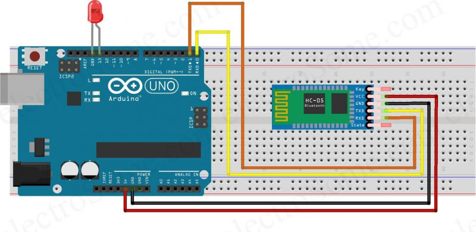

Arduino Bluetooth Light Control

This project demonstrates how to control a LED/Relay/Light using Bluetooth and Arduino.
It allows turning the light ON or OFF via a smartphone or Bluetooth terminal app, with live feedback displayed on the Serial Monitor.

🔧 Components Required

Arduino Uno (or compatible board)

Bluetooth Module (HC-05 / HC-06)

LED / Relay

Jumper Wires

Breadboard

⚡ Features

Control light ON/OFF via Bluetooth

Serial Monitor displays Light ON / Light OFF status

Easy to customize for different pins or devices

⚡ Circuit Diagram

🎥 Demo Video

Check out the working demo on my YouTube channel:
👉 Ecempire7

🚀 Steps to Run

Connect the Bluetooth module to Arduino (TX → RX, RX → TX, VCC → 5V, GND → GND).

Connect an LED/Relay to pin D13.

Upload the Arduino code from this repository.

Pair your smartphone or PC with the Bluetooth module.

Open a Bluetooth serial terminal app at 9600 baud.

Send 1 → LED/Light turns ON.

Send 0 → LED/Light turns OFF.

Observe Serial Monitor for status updates.
